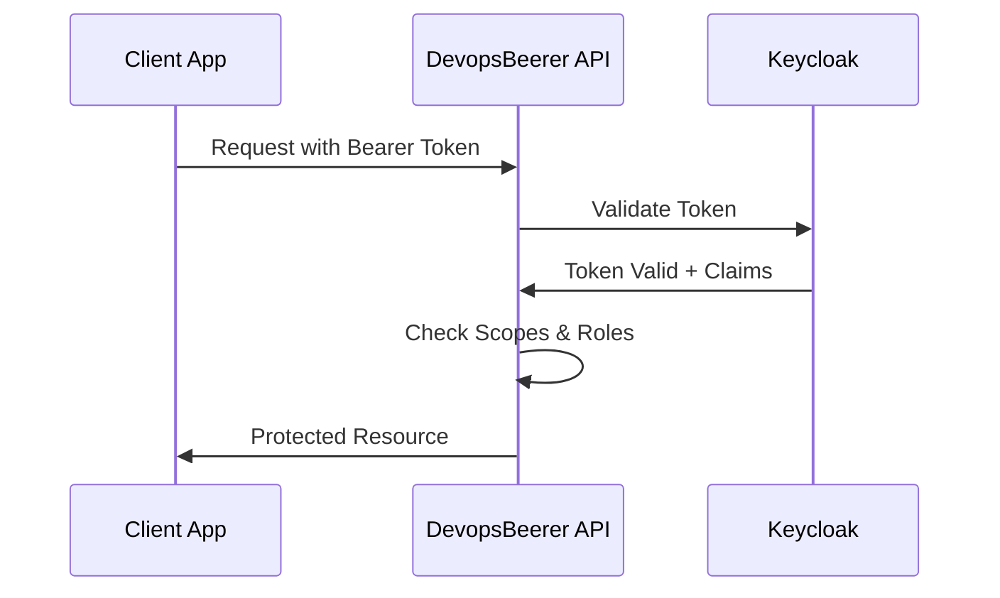

# DevopsBeerer API

A RESTful API demonstrating **OAuth2/OIDC Bearer Token Authentication** and **Resource Server Security** patterns. This Express.js backend is part of the **DevopsBeerer playground** - an educational platform designed to help developers understand OAuth2 and OIDC standards through practical, hands-on examples.

## 🍺 About the Project

**DevopsBeerer API** serves as the **resource server** in the OAuth2 ecosystem, showcasing how modern APIs securely validate tokens, enforce authorization policies, and protect resources. This backend application demonstrates real-world patterns for building secure, token-protected APIs.

### Key Concepts Demonstrated

- **Bearer Token Validation** - Verifying JWT access tokens from Keycloak
- **Resource Server Security** - Protecting API endpoints with OAuth2 scopes
- **Role-Based Access Control (RBAC)** - Fine-grained permissions using Keycloak roles
- **Scope-Based Authorization** - API access control through OAuth2 scopes
- **JWT Token Introspection** - Understanding and validating token claims
- **API Security Patterns** - Best practices for protected resource servers

## 🏗️ API Features

The API provides comprehensive beer and order management endpoints to demonstrate various OAuth2 security scenarios:

### Protected Endpoints

- **Beer Management**
  - `GET /v1.0.0/beers` - List beers (requires `Beers.Read.All` scope)
  - `GET /v1.0.0/beers/{id}` - Get beer details (requires `Beers.Read` scope)
  - `POST /v1.0.0/beers` - Create beer (requires `Beers.Write` scope + `admin` role)
  - `PATCH /v1.0.0/beers/{id}` - Update beer (requires `Beers.Write` scope + `admin` role)
  - `DELETE /v1.0.0/beers/{id}` - Delete beer (requires `Beers.Write` scope + `admin` role)

- **Order Management**
  - `GET /v1.0.0/orders` - List orders (protected by bearer token)
  - `POST /v1.0.0/orders` - Create order (protected by bearer token)
  - `GET /v1.0.0/orders/{id}` - Get order details (protected by bearer token)
  - `PATCH /v1.0.0/orders/{id}` - Update order status (protected by bearer token)
  - `DELETE /v1.0.0/orders/{id}` - Delete order (protected by bearer token)

### Security Layers

1. **Bearer Token Authentication** - All endpoints require valid JWT tokens
2. **Scope-Based Authorization** - Different operations require specific OAuth2 scopes
3. **Role-Based Access Control** - Administrative operations require elevated roles
4. **Token Validation** - Real-time validation against Keycloak

## 🚀 Development Setup

### Prerequisites

- Node.js (Latest LTS version recommended)
- TypeScript knowledge
- Access to a Keycloak instance for token validation
- Understanding of JWT tokens and OAuth2 concepts

### Getting Started

1. **Install dependencies**

   ```bash
   npm install
   ```

2. **Configure environment variables**
   Create a `.env` file with your Keycloak settings:

   ```env
   NODE_ENV=development
   PORT=3000
   KEYCLOAK_URL=http://localhost:8080
   KEYCLOAK_REALM=devopsbeerer
   KEYCLOAK_AUDIENCE=beerer-api
   ```

3. **Initialize database**
   The API uses lowdb for simple file-based storage. Initial beer data is loaded from `db.init.json`:

   ```bash
   # The database will be automatically created on first run
   # with sample beer data from db.init.json
   ```

4. **Start development server**

   ```bash
   npm run dev
   ```

   API will be available at `http://localhost:3000`

5. **View API documentation**

   Access the OpenAPI specification at:

   ```
   http://localhost:3000/v1.0.0/doc
   ```

### Available Scripts

- `npm run dev` - Start development server with hot reload
- `npm run build` - Compile TypeScript to JavaScript
- `npm start` - Start production server
- `npm test` - Run unit tests (if configured)

## 🔧 Architecture & Security

### Authentication Flow



### Middleware Stack

1. **Passport Keycloak Strategy** - Validates bearer tokens against Keycloak
2. **Scope Middleware** - Enforces OAuth2 scope requirements
3. **Role Middleware** - Validates user roles for elevated permissions
4. **Error Handling** - Standardized error responses for auth failures

### Token Claims Structure

The API expects JWT tokens with the following structure:

```json
{
  "sub": "user-uuid",
  "scope": "Beers.Read Beers.Write",
  "roles": ["user", "admin"],
  "preferred_username": "john.doe",
  "email": "john.doe@example.com"
}
```

## 📊 API Examples

### Making Authenticated Requests

```bash
# Get all beers (requires Beers.Read.All scope)
curl -H "Authorization: Bearer YOUR_ACCESS_TOKEN" \
     http://localhost:3000/v1.0.0/beers

# Create a new beer (requires Beers.Write scope + admin role)
curl -X POST \
     -H "Authorization: Bearer YOUR_ACCESS_TOKEN" \
     -H "Content-Type: application/json" \
     -d '{"name":"IPA Supreme","style":"IPA","abv":6.5,"ibu":65,"quantity":10}' \
     http://localhost:3000/v1.0.0/beers
```

### Error Responses

```json
{
  "code": 401,
  "message": "Authentication is required to access this resource"
}

{
  "code": 403,
  "message": "You don't have permission to access this resource"
}
```

## 🔒 Security Features

### Scope-Based Authorization

Different API operations require specific OAuth2 scopes:

- `Beers.Read` - Read individual beer details
- `Beers.Read.All` - List all beers
- `Beers.Write` - Create, update, or delete beers

### Role-Based Access Control

Administrative operations require the `admin` role in addition to appropriate scopes.

### Token Validation

- **Signature Verification** - Validates JWT signature against Keycloak public keys
- **Expiration Checking** - Ensures tokens haven't expired
- **Audience Validation** - Confirms tokens are issued for this API
- **Issuer Verification** - Validates tokens come from trusted Keycloak realm

## 🏥 Health & Monitoring

The API includes Kubernetes-ready health check endpoints:

```bash
# Liveness probe
GET /health/liveness

# Readiness probe  
GET /health/readiness
```

## 📚 Learning Objectives

By exploring and developing with this API, you'll understand:

- How resource servers validate and process bearer tokens
- The difference between authentication and authorization in APIs
- Implementing fine-grained access control with scopes and roles
- Best practices for secure API design
- JWT token structure and claims validation
- OAuth2 resource server security patterns
- Error handling and security responses

## 🛠️ Extending the API

### Adding New Protected Endpoints

1. **Define the route** in the appropriate route file
2. **Add scope middleware** for OAuth2 scope enforcement
3. **Add role middleware** if elevated permissions needed
4. **Update OpenAPI spec** for documentation

Example:

```typescript
router.get('/special', 
  requireScope('Special.Read'), 
  requireRole('premium'), 
  async (req: Request, res: Response) => {
    // Your protected logic here
  }
);
```

### Custom Authorization Logic

Create new middleware for complex authorization scenarios:

```typescript
const requireOwnership = (req: Request, res: Response, next: NextFunction) => {
  const userId = req.authInfo?.sub;
  const resourceUserId = req.params.userId;
  
  if (userId !== resourceUserId && !req.authInfo?.roles?.includes('admin')) {
    return res.status(403).json({ code: 403, message: "Access denied" });
  }
  
  next();
};
```

## 🐳 Docker & Deployment

The API is containerized and ready for deployment:

```dockerfile
# Example Dockerfile structure
FROM node:lts-alpine
WORKDIR /app
COPY package*.json ./
RUN npm ci --only=production
COPY dist/ ./dist/
EXPOSE 3000
CMD ["npm", "start"]
```

### Environment Configuration

Configure for different environments:

```bash
# Development
NODE_ENV=development
KEYCLOAK_URL=http://localhost:8080

# Production  
NODE_ENV=production
KEYCLOAK_URL=https://auth.yourcompany.com
```

## 🤝 Contributing

This is an educational project focused on demonstrating OAuth2/OIDC patterns clearly and correctly. The codebase prioritizes readability and educational value while maintaining production-quality security practices.

---

*Part of the DevopsBeerer playground - Making OAuth2 and OIDC standards accessible through practical examples* 🍻
